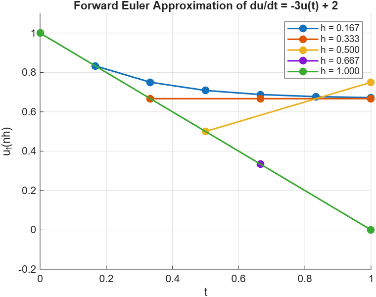
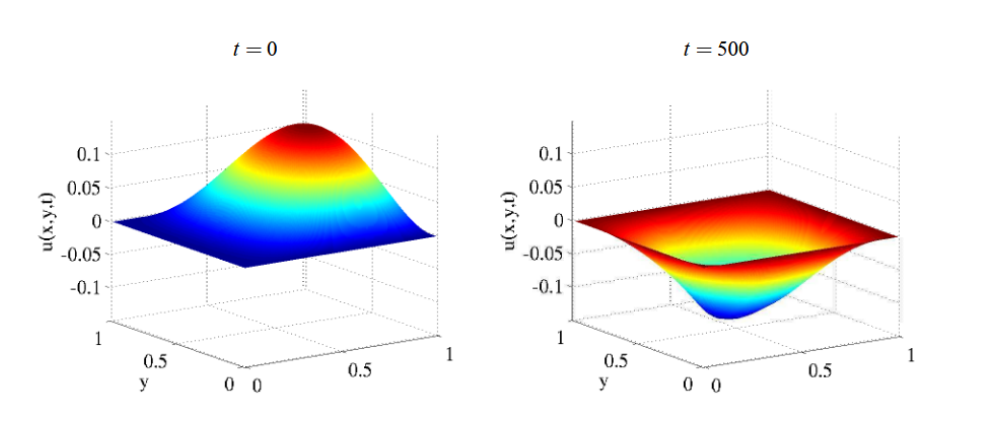

# CS 377P Spring 2026: Assignment 3

### Jenny Nguyen jtn2497

## 1. (Finite-differences, 10 points)

#### In lecture, we considered the ode $\frac{du}{dt} = -3u(t) + 2$ with initial condition $u(0) = 1$. Using the forward Euler discretization scheme, we came up with the following recurrence equation:

$$u_f(0) = 1$$
$$u_f(nh + h) = (1 - 3h)u_f(nh) + 2h$$

#### where $u_f(nh)$ is the approximation for $u$ at $t = nh$. In this problem, you will study the behavior of the approximate solution for different values of $h$.

#### **(a)** Consider the following values of $h$ : 1/6, 1/3, 1/2, 2/3, 1. On a single graph, plot the points for each value of $h$, using a different color for each $h$, in the interval $0 \leq t \leq 1$.

#### **(b)** At what value of $h$ does the approximate solution start to oscillate instead of decreasing monotonically?

&emsp;The approximate solution starts to oscillate instead of decreasing
monotonically for when $h > 1/3$.

#### **(c)** At what value of $h$ does the approximate solution become unstable and blow up?

&emsp;The approximate solution becomes unstable and blows up when $h > 2/3$.

#### **(d)** Explain these results analytically using the difference equation. Hint: look at the values of $(1 - 3h)$.

&emsp;When $h = 1/6$, the value of $(1 - 3h)$ is $1/2$, which is positive and
less than 1, so the approximate solution remains positive but decreases slowly
towards the target. When $h = 1/3$, $(1 - 3h)$ becomes 0, so the solution sits
and remains at the target since the equation becomes $u_f(h) = 2h$. When
$h = 1/2$, $(1 - 3h)$ becomes negative but between -1 and 0, so it begins to
oscillate around the target and slowly moves toward the target. When $h = 2/3$,
$(1 - 3h)$ becomes equal to -1, so it oscillates around the target and remains
at the same distance away from the target. Finally, when $h = 1$, $(1 - 3h)$ is
-2, so the solution becomes unstable since at each step, the solution strays
further and further away from the target.

## 2. (Iterative solution of linear systems, 5 points)

#### Consider the linear system $$4x + 2y = 6$$ $$x - 5y = -4$$

#### **(a)** (2 points) Write down the recurrence relation that corresponds to solving this system using the Jacobi method, starting with the initial approximation $(x_1 = 0, y_1 = 0)$. Use the first equation to refine the approximation for $x$ and the second equation to refine the approximation for $y$. Express this recurrence as a computation involving matrices and vectors.

#### **(b)** (1 points) Compute the first 10 approximations $(x_i, y_i)$ and plot a 3D plot $(x, y, i)$ in which the z-axis is the iteration number $i$. Give an intuitive explanation of this 3D plot. You do not need to turn in any code but turn in your plot and explanation.

#### **(c)** (2 points) Repeat these two parts for the Gauss-Seidel method. You can find a description of the Gauss-Seidel method online.

## 3. (ODE's, 15 points)

Consider the second-order differential equation

$$\frac{d²y}{dx²} = -y$$

with inital conditions $y(0) = 0$, $y'(0) = 1$. The exact solution of this
equation is $y = sin(x)$.

**(a)** (3 points) What is the difference equation if we use the forward-Euler
method to discretize derivatives?

**(b)** (2 points) Discretize the initial conditions to find expressions for the
first two terms in the solution to the difference equation.

**(c)** (5 points) Calculate the solutions to the difference equation in the
interval $x = [0, 2π]$ for $h = 0.01$, $0.1$, $1.0$, $2.0$. Graph each solution
together with the exact solution, using a separate graph for each value of $h$.
What trends do you see in your plots? No need to turn in code for the
calculations.

**(d)** (5 points) Repeat these steps with the backward-Euler discretization.
For this part, you need to discretize the initial condition $y'(0) = 1$ by
considering the value of $y(-h)$ (i.e, one time-step before 0). Using the
backward-Euler formula for the first derivative, we get
$\frac{y_b(0) - y_b(-h)}{h} = 1$, so $y_b(-h) = y_b(0) - h = -h$ since
$y_b(0) = 0$ from the other boundary condition. Use the values of $y_b(-h)$ and
$y_b(0)$ to "turn the crank" and compute the remaining values of $y_b(nh)$.

## 4. (PDE's, 20 points)

Consider the 2D heat conduction problem discussed in lecture in which we solved
the heat equation for given boundary conditions, using a grid that had 4
interior points (see Slide 23). Repeat this exercise using a grid obtained by
dividing the x and y ranges into 6 equal sized intervals, rather than 3
intervals as in the lecture example. You should have 25 interior points so you
will have to construct a 25x25 matrix A, and solve a linear system $Ax = b$ to
find the solution. You may want to write a program to construct this matrix. Use
a linear solver from MATLAB, Octave or any other program of your choice.

What to turn in: What are the temperature values at the 4 original grid points
when you use this finer grid?

## 5. (PDE's 40 points)

In this problem, we consider a membrane in the unit square that is clamped along
its edges. At $t = 0$, the membrane is pulled into some initial shape given by
the initial conditions, and then released. Intuitively, we would expect the
membrane to keep vibrating as shown in Figure [1](#figure-1). The problem is to
solve a pde to find the shape of the membrane over time. Here are the details:

- The independent variables $(x, y)$ are in the unit square $[0,1]x[0,1]$.
- $u(x, y, t)$ is the displacement at position $(x, y)$ at time $t$. $u$ is the
dependent variable, and its value tells you how far a given point $(x, y)$ has
moved from the $(x, y)$ place at time $t$. Figure [1](#figure-1) illustrates
this for $t = 0$ and $t = 500$.
- Wave equation: $\frac{δ²u}{δt²} = \frac{δ²u}{δx²} + \frac{δ²u}{δy²}$.
- $u(0, y, t) = u(1, y, t) = u(x, 0, t) = u(x, 1, t) = 0$ (clamped boundary
conditions, see Figure [1](#figure-1))
- $u(x, y, 0) = 4 * x² * y(1 - x)(1 - y)$ (initial condition, see Figure
[1](#figure-1)(a))
- $u'(x, y, 0) = 0$ (initial condition, membrane is at rest at $t = 0$)
- Use centered differences to discretize both space and time.
- Spatial discretization step $Δx$, $Δy = 0.01$
- Time discretization step $= Δt = 0.0025$
- Number of time steps $= 500$

Figure [1](#figure-1) shows the function $u(x, y, t)$ at $t = 0$ (initial
condition) and at $t = 500$. Use the second diagram to check your answer.

*Figure 1: Vibrating membrane at t = 0 and at t = 500*
  

Conceptually, you are filling in a series of arrays of size (100x100) that has
one such array for each time step.

What to turn in:

**(a)** The difference equation obtained by discretizing the pde.

**(b)** A short paragraph on how you discretized the initial conditions. Note
that because you are using centered differences, you will have to compute the
values of $u(x, y, −∆t)$ using the boundary condition for $u′$ just like you did
in Problem 3(d) for the backward-Euler method. Here you would use the centered
difference approximation to the first derivative to compute the values of
$u(x, y, −∆t)$, from which you can turn the crank and compute the remaining
values of $u$.

**(c)** Plot a graph similar to the ones in Figure [1](#figure-1) for $t = 200$.

**(d)** Plot a graph of $u(0.5 ,0.5, t)$ for $0 \leq t \leq 500$. Intuitively,
this shows you the displacement of the point $(0.5, 0.5)$ in the membrane over
time.

**(e)** Your code for computing the solution.

## 6. (Short answers, 10 points)

**(a)** (2 points) What is a commutative function? Associative function? Give an
example of a function that is commutative but not associative. Give an example
of a function that is associative but not commutative.

**(b)** (2 points) What is the difference between a problem and an algorithm? Is
SSSP a problem or algorithm? If it is a problem, name two algorithms for solving
the SSSP problem and write down the asymptotic complexity of each algorithm.
What algorithm would you use in a parallel implementation? For the last
question, justify your answer briefly.

**(c)** (2 points) Explain briefly why the average diameter of a very large
power-law graph with billions of vertices may be as small as 5-10. Who was
Stanley Milgram and how is he connected to power-law graphs and social networks?

**(d)** (2 points) In implementing the Barnes-Hut algorithm, we usually rebuild
the spatial decomposition tree from scratch rather than incrementally updating
it between time steps. Explain why, using the phrase ”Amdahl’s Law” in your
answer.

**(e)** (2 points) How do direct methods for solving linear systems work? Name
two direct methods. Why are direct methods not used very often for solving
sparse linear systems?