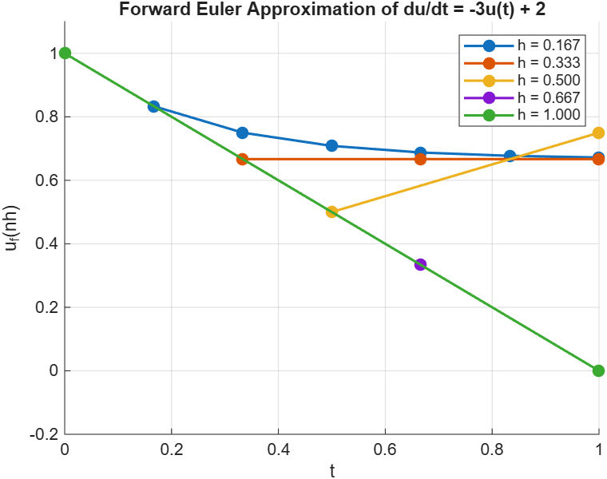
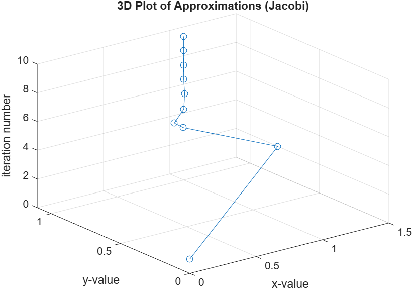
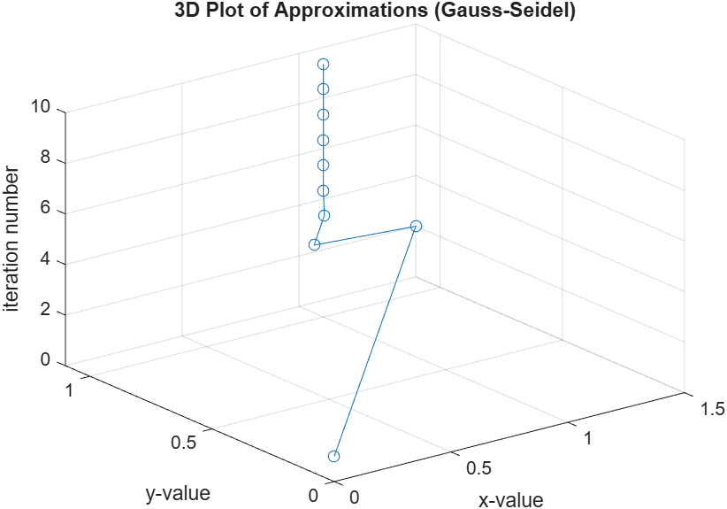
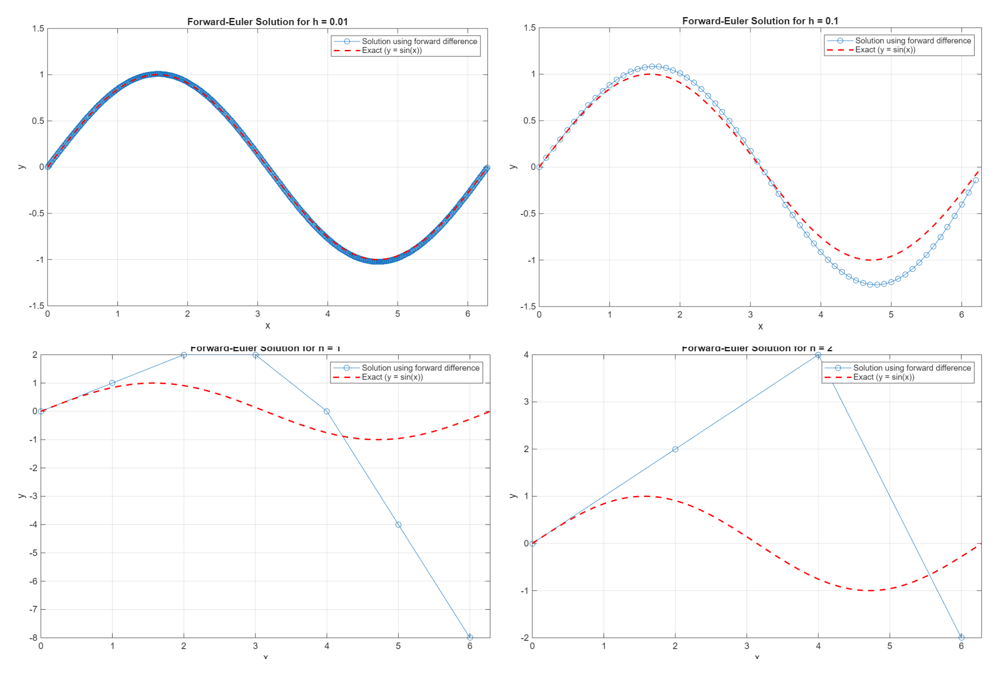
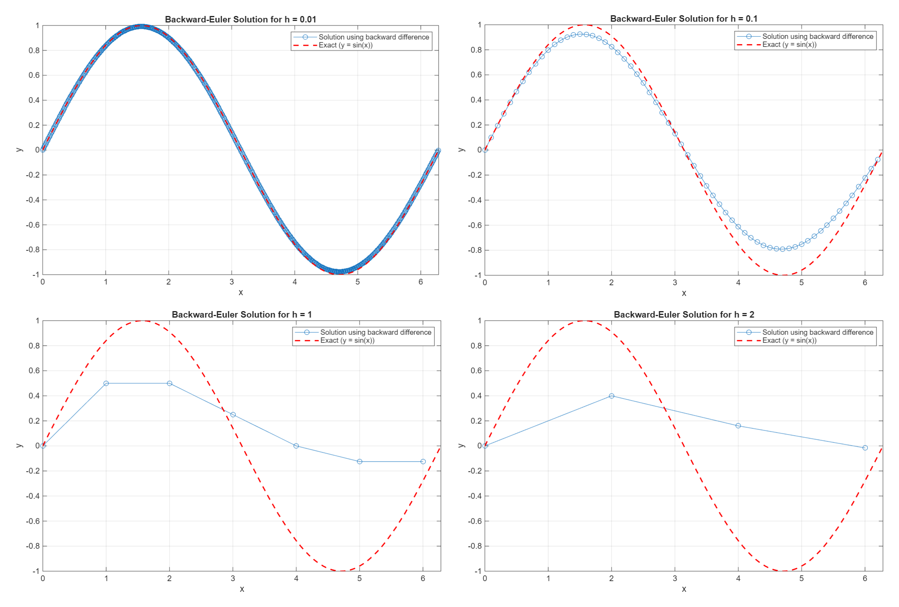
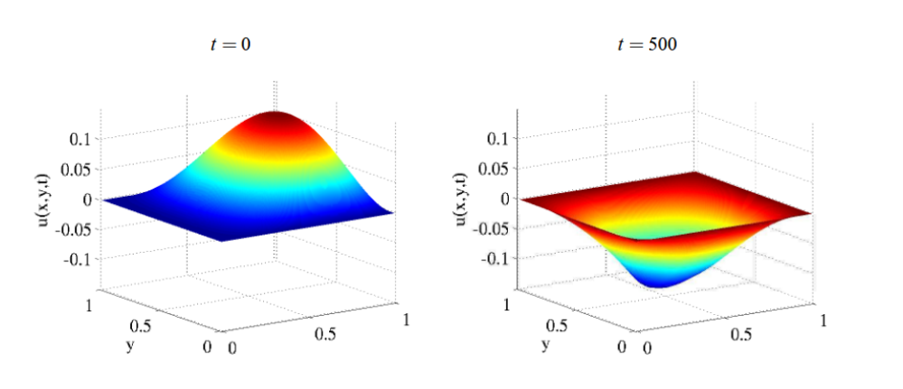
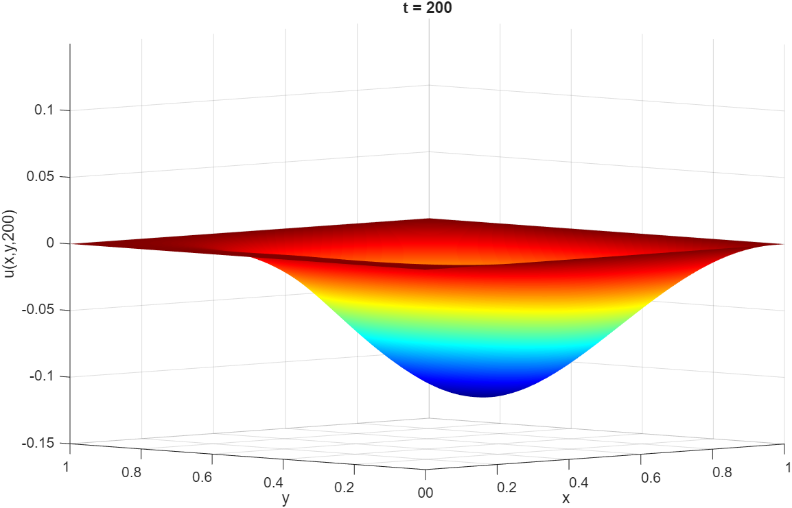
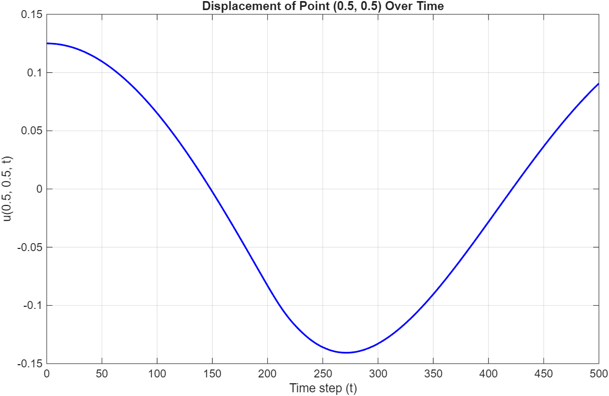

# CS 377P Spring 2026: Assignment 3

### Jenny Nguyen jtn2497

## 1. (Finite-differences, 10 points)

#### In lecture, we considered the ode $\frac{du}{dt} = -3u(t) + 2$ with initial condition $u(0) = 1$. Using the forward Euler discretization scheme, we came up with the following recurrence equation:

$$u_f(0) = 1$$
$$u_f(nh + h) = (1 - 3h)u_f(nh) + 2h$$

#### where $u_f(nh)$ is the approximation for $u$ at $t = nh$. In this problem, you will study the behavior of the approximate solution for different values of $h$.

#### **(a)** Consider the following values of $h$ : 1/6, 1/3, 1/2, 2/3, 1. On a single graph, plot the points for each value of $h$, using a different color for each $h$, in the interval $0 \leq t \leq 1$.



#### **(b)** At what value of $h$ does the approximate solution start to oscillate instead of decreasing monotonically?

&emsp;The approximate solution starts to oscillate instead of decreasing monotonically for when $h > 1/3$.

#### **(c)** At what value of $h$ does the approximate solution become unstable and blow up?

&emsp;The approximate solution becomes unstable and blows up when $h > 2/3$.

#### **(d)** Explain these results analytically using the difference equation. Hint: look at the values of $(1 - 3h)$.

&emsp;When $h = 1/6$, the value of $(1 - 3h)$ is $1/2$, which is positive and less than 1, so the approximate solution remains positive but decreases slowly towards the target (2/3). When $h = 1/3$, $(1 - 3h)$ becomes 0, so the solution sits and remains at the target since the equation becomes $u_f(h) = 2h$. When
$h = 1/2$, $(1 - 3h)$ becomes negative but between -1 and 0, so it begins to oscillate around the target and slowly moves toward the target. When $h = 2/3$,
$(1 - 3h)$ becomes equal to -1, so it oscillates around the target and remains at that same distance away from the target. Finally, when $h = 1$, $(1 - 3h)$ is
-2, so the solution becomes unstable since at each step, the solution strays further and further away from the target.

## 2. (Iterative solution of linear systems, 5 points)

#### Consider the linear system

$4x + 2y = 6$

$x - 5y = -4$

#### **(a)** (2 points) Write down the recurrence relation that corresponds to solving this system using the Jacobi method, starting with the initial approximation $(x_1 = 0, y_1 = 0)$. Use the first equation to refine the approximation for $x$ and the second equation to refine the approximation for $y$. Express this recurrence as a computation involving matrices and vectors.

&emsp;Recurrence relation using Jacobi method:

&emsp;&emsp;$x_{i+1} = (6 - 2y_i) / 4$

&emsp;&emsp;$y_{i+1} = (4 + x_i) / 5$

&emsp;Using matrices and vectors:

&emsp;&emsp;$\begin{pmatrix}x_{i+1}\\y_{i+1}\end{pmatrix} =\begin{pmatrix}x_i\\y_i\end{pmatrix} -\begin{pmatrix}1/4 & 0\\0 & -1/5\end{pmatrix} \begin{pmatrix}4x + 2y - 6\\x - 5y + 4\end{pmatrix}$

#### **(b)** (1 points) Compute the first 10 approximations $(x_i, y_i)$ and plot a 3D plot $(x, y, i)$ in which the z-axis is the iteration number $i$. Give an intuitive explanation of this 3D plot. You do not need to turn in any code but turn in your plot and explanation.

| $i$ | 1 | 2 | 3 | 4 | 5 | 6 | 7 | 8 | 9 | 10 |
|---|---|---|---|---|---|---|---|---|---|---|
| $x$ | 0 | 1.5000 | 1.1000 | 0.9500 | 0.9900 | 1.0050 | 1.0010 | 0.9995 | 0.9999 | 1.0000 |
| $y$ | 0 | 0.8000 | 1.1000 | 1.0200 | 0.9900 | 0.9980 | 1.0010 | 1.0002 | 0.9999 | 1.0000 |



&emsp;In the 3D plot using the Jacobi method, the points start off spiraling around and begin to narrow as the iteration number increases. It eventually centers around the vertical line $(1, 1, i)$, which is the solution to the linear system. The spiral effect occurs because the Jacobi method updates values based on the previous step's error, so the approximations begin way off from the actual solution before slowly moving towards the solution, and this visualizes the reduction of the residual error after each iteration of the Jacobi method.

#### **(c)** (2 points) Repeat these two parts for the Gauss-Seidel method. You can find a description of the Gauss-Seidel method online.

&emsp;Recurrence relation using Gauss-Seidel method:

&emsp;&emsp;$x_{i+1} = (6 - 2y_i) / 4$

&emsp;&emsp;$y_{i+1} = (4 + x_{i+1}) / 5$

&emsp;Using matrices and vectors:

&emsp;&emsp;$\begin{pmatrix}x_{i+1}\\y_{i+1}\end{pmatrix} =\begin{pmatrix}x_i\\y_i\end{pmatrix} -\begin{pmatrix}4 & 0\\1 & -5\end{pmatrix}^{-1} \begin{pmatrix}4x + 2y - 6\\x - 5y + 4\end{pmatrix}$

| $i$ | 1 | 2 | 3 | 4 | 5 | 6 | 7 | 8 | 9 | 10 |
|---|---|---|---|---|---|---|---|---|---|---|
| $x$ | 0 | 1.5000 | 0.9500 | 1.0050 | 0.9995 | 1.0000 | 1.0000 | 1.0000 | 1.0000 | 1.0000 |
| $y$ | 0 | 1.1000 | 0.9900 | 1.0010 | 0.9999 | 1.0000 | 1.0000 | 1.0000 | 1.0000 | 1.0000 |



&emsp;In the 3D plot using the Gauss-Seidel method, the points are quicker to approach the solution $(1, 1, i)$ compared to the Jacobi method. This is because the Gauss-Seidel method uses the new value of $x$ immediately after calculating it in the equation to calculate $y$. The points also eventually center at the actual solution, shown by the vertical line, but the path is more direct and faster than the spiral seen in the graph for the Jacobi method. As the iteration number increases, the horizontal distance between the points shrinks, and the points eventually converge to form the vertical line, which visualizes the reduction of the residual error.

## 3. (ODE's, 15 points)

#### Consider the second-order differential equation
$\frac{d²y}{dx²} = -y$

#### with inital conditions $y(0) = 0$, $y'(0) = 1$. The exact solution of this equation is $y = sin(x)$.

#### **(a)** (3 points) What is the difference equation if we use the forward-Euler method to discretize derivatives?

&emsp;$\frac{y_f(nh + 2h) - 2y_f(nh + h) + y_f(nh)}{h^2} = -y_f(nh)$

&emsp;$y_f(nh + 2h) - 2y_f(nh + h) + y_f(nh) = -(h^2)y_f(nh)$

&emsp;$y_f(nh + 2h) = -(h^2)y_f(nh) + 2y_f(nh + h) - y_f(nh)$

&emsp;$y_f(nh + 2h) = 2y_f(nh + h) - (1 + h^2)y_f(nh)$

&emsp;So the difference equation is: $y_f(nh + 2h) = 2y_f(nh + h) - (1 + h^2)y_f(nh)$.

#### **(b)** (2 points) Discretize the initial conditions to find expressions for the first two terms in the solution to the difference equation.

&emsp;$y_f(0) = 0$

&emsp;$\frac{y_f(h) - y_f(0)}{h} = y'(0) = 1$ &rarr; $y_f(h) = y_f(0) + h = h$

&emsp;So,

&emsp;$y_f(2h) = 2y_f(h) - (1 + h^2)y_f(0) = 2(h) - (1 + h^2)(0) = 2h$

&emsp;$y_f(3h) = 2y_f(2h) - (1 + h^2)y_f(h) = 2(2h) - (1 + h^2)(h) = 4h - (h + h^3) = 3h - h^3$

#### **(c)** (5 points) Calculate the solutions to the difference equation in the interval $x = [0, 2π]$ for $h = 0.01$, $0.1$, $1.0$, $2.0$. Graph each solution together with the exact solution, using a separate graph for each value of $h$. What trends do you see in your plots? No need to turn in code for the calculations.



&emsp;With smaller step sizes, the solution using the forward difference is much closer to the exact solution, but as the step size grows, the gap between the solution and the exact solution becomes much wider. At $h = 1.0$ and $h = 2.0$, the solution becomes jagged and begins to drift away from the shape of the sine wave, and this is because the step sizes are too large to accurately depict the curvature of the sine wave.

#### **(d)** (5 points) Repeat these steps with the backward-Euler discretization. For this part, you need to discretize the initial condition $y'(0) = 1$ by considering the value of $y(-h)$ (i.e, one time-step before 0). Using the backward-Euler formula for the first derivative, we get $\frac{y_b(0) - y_b(-h)}{h} = 1$, so $y_b(-h) = y_b(0) - h = -h$ since $y_b(0) = 0$ from the other boundary condition. Use the values of $y_b(-h)$ and $y_b(0)$ to "turn the crank" and compute the remaining values of $y_b(nh)$.

&emsp;Difference equation:

&emsp;&emsp;$\frac{y_b(nh) - 2y_b(nh - h) + y_b(nh - 2h)}{h^2} = -y_b(nh)$

&emsp;&emsp;$y_b(nh) - 2y_b(nh - h) + y_b(nh - 2h) = -(h^2)y_b(nh)$

&emsp;&emsp;$y_b(nh) - 2y_b(nh - h) + y_b(nh - 2h) = -(h^2)y_b(nh)$

&emsp;&emsp;$y_b(nh) + (h^2)y_b(nh) = 2y_b(nh - h) - y_b(nh - 2h)$

&emsp;&emsp;$(1 + h^2)y_b(nh) = 2y_b(nh - h) - y_b(nh - 2h)$

&emsp;&emsp;So the difference equation is: $y_b(nh) = \frac{2y_b(nh - h) - y_b(nh - 2h)}{1 + h^2}$

&emsp;First two terms in the solution to the difference equation:

&emsp;&emsp;$\frac{y_b(0) - y_b(-h)}{h} = y'(0) = 1$ &rarr; $y_b(-h) = y_b(0) - h = -h$

&emsp;&emsp;$y_b(0) = 0$

&emsp;&emsp;So,

&emsp;&emsp;$y_b(h) = \frac{2y_b(0) - y_b(-h)}{1 + h^2} = \frac{2(0) - (-h)}{1 + h^2} = \frac{h}{1 + h^2}$

&emsp;&emsp;$y_b(2h) = \frac{2y_b(h) - y_b(0)}{1 + h^2} = \frac{(2h)/(1+h^2) - 0}{1 + h^2} = \frac{2h}{(1 + h^2)^2}$

&emsp;Solutions to the difference equation graph:



&emsp;With smaller step sizes, the solution using the backward difference equation stays much closer to the exact solution, but as the step size grows, the amplitude shrinks significantly compared to the exact solution. At $h = 1.0$ and $h = 2.0$, the solution becomes jagged and aggressively decays toward zero, drifting away from the true shape of the sine wave because the large step sizes and the $(1 + h^2)$ divisor cause the method to fail to accurately depict the curvature. However, in comparison to using the forward difference equation, the backward difference is a lot more stable for larger step sizes mainly because of the divisor, which effectively shrinks the solution and prevents it from growing out of control as step size grows.

## 4. (PDE's, 20 points)

#### Consider the 2D heat conduction problem discussed in lecture in which we solved the heat equation for given boundary conditions, using a grid that had 4 interior points (see Slide 23). Repeat this exercise using a grid obtained by dividing the x and y ranges into 6 equal sized intervals, rather than 3 intervals as in the lecture example. You should have 25 interior points so you will have to construct a 25x25 matrix A, and solve a linear system $Ax = b$ to find the solution. You may want to write a program to construct this matrix. Use a linear solver from MATLAB, Octave or any other program of your choice.

#### What to turn in: What are the temperature values at the 4 original grid points when you use this finer grid?

&emsp;$\frac{∂^2u}{∂x^2} = \frac{\frac{u(nh+h,mh)-u(nh,mh)}{h} - \frac{u(nh,mh)-u(nh-h,mh)}{h}}{h}$

&emsp;$\frac{∂^2u}{∂y^2} = \frac{\frac{u(nh,mh+h)-u(nh,mh)}{h} - \frac{u(nh,mh)-u(nh,mh-h)}{h}}{h}$

&emsp;$\frac{\frac{u(nh+h,mh)-u(nh,mh)}{h} - \frac{u(nh,mh)-u(nh-h,mh)}{h}}{h} + \frac{\frac{u(nh,mh+h)-u(nh,mh)}{h} - \frac{u(nh,mh)-u(nh,mh-h)}{h}}{h} = 0$

&emsp;$u(nh+h,mh) + u(nh-h,mh) + u(nh,mh+h) + u(nh,mh-h) - 4u(nh,mh) = 0$

```matlab
n = 5; % Number of interior points per row/column
N = n^2; % Total interior points
A = zeros(N, N);
b = zeros(N, 1);

% Boundary temperatures
T_top = 100; T_bottom = 300; T_left = 50; T_right = 200;

for j = 1:n
    for i = 1:n
        row = (j-1)*n + i;
        A(row, row) = -4;
        
        % Left neighbor (i-1)
        if i > 1
            A(row, row-1) = 1;
        else 
            b(row) = b(row) - T_left; 
        end

        % Right neighbor (i+1)
        if i < n
            A(row, row+1) = 1;
        else
            b(row) = b(row) - T_right;
        end

        % Bottom neighbor (j-1)
        if j > 1
            A(row, row-n) = 1;
        else
            b(row) = b(row) - T_bottom;
        end

        % Top neighbor (j+1)
        if j < n
            A(row, row+n) = 1;
        else
            b(row) = b(row) - T_top;
        end
    end
end

% Solve the linear system
u_interior = A \ b;
results = reshape(u_interior, n, n)';
results = flipud(results);
disp(results);
```

&emsp;Output:

```
   85.9596  105.5959  118.9996  131.6565  151.5657
   88.2425  117.4242  138.7461  156.0606  174.6062
   99.5862  137.1125  162.5000  179.2337  190.7984
  122.9900  168.9394  194.9077  207.5758  209.3536
  173.4343  220.7474  240.6158  246.8080  239.0404
```

&emsp;Temperature values at the 4 original grid points:

- $T_1 = 117.4242°C$
- $T_2 = 156.0606°C$
- $T_3 = 168.9394°C$
- $T_4 = 207.5758°C$

## 5. (PDE's 40 points)

#### In this problem, we consider a membrane in the unit square that is clamped along its edges. At $t = 0$, the membrane is pulled into some initial shape given by the initial conditions, and then released. Intuitively, we would expect the membrane to keep vibrating as shown in Figure [1](#figure-1). The problem is to solve a pde to find the shape of the membrane over time. Here are the details:

- The independent variables $(x, y)$ are in the unit square $[0,1]x[0,1]$.
- $u(x, y, t)$ is the displacement at position $(x, y)$ at time $t$. $u$ is the dependent variable, and its value tells you how far a given point $(x, y)$ has moved from the $(x, y)$ place at time $t$. Figure [1](#figure-1) illustrates this for $t = 0$ and $t = 500$.
- Wave equation: $\frac{δ²u}{δt²} = \frac{δ²u}{δx²} + \frac{δ²u}{δy²}$.
- $u(0, y, t) = u(1, y, t) = u(x, 0, t) = u(x, 1, t) = 0$ (clamped boundary conditions, see Figure [1](#figure-1))
- $u(x, y, 0) = 4 * x² * y(1 - x)(1 - y)$ (initial condition, see Figure [1](#figure-1)(a))
- $u'(x, y, 0) = 0$ (initial condition, membrane is at rest at $t = 0$)
- Use centered differences to discretize both space and time.
- Spatial discretization step $Δx$, $Δy = 0.01$
- Time discretization step $= Δt = 0.0025$
- Number of time steps $= 500$

#### Figure [1](#figure-1) shows the function $u(x, y, t)$ at $t = 0$ (initial condition) and at $t = 500$. Use the second diagram to check your answer.



*Figure 1: Vibrating membrane at t = 0 and at t = 500*
<br><br>

#### Conceptually, you are filling in a series of arrays of size (100x100) that has one such array for each time step.

#### What to turn in:

#### **(a)** The difference equation obtained by discretizing the pde.

&emsp;$\frac{δ²u}{δt²} = \frac{δ²u}{δx²} + \frac{δ²u}{δy²}$

&emsp;$\frac{u(x,y,t+Δt)-2u(x,y,t)+u(x,y,t-Δt)}{Δt^2} = \frac{u(x+Δx,y,t)-2u(x,y,t)+u(x-Δx,y,t)}{Δx^2} + \frac{u(x,y+Δy,t)-2u(x,y,t)+u(x,y-Δy,t)}{Δy^2}$

&emsp;$u(x,y,t+Δt)-2u(x,y,t)+u(x,y,t-Δt) = \frac{Δt^2}{Δx^2}(u(x+Δx,y,t)-2u(x,y,t)+u(x-Δx,y,t)) +$<br/>
&emsp;$\frac{Δt^2}{Δy^2}(u(x,y+Δy,t)-2u(x,y,t)+u(x,y-Δy,t))$

&emsp;So the difference equation is:

&emsp;$u(x,y,t+Δt) = 2u(x,y,t) - u(x,y,t-Δt) + \frac{Δt^2}{Δx^2}(u(x+Δx,y,t)-2u(x,y,t)+u(x-Δx,y,t)) +$<br/>
&emsp;$\frac{Δt^2}{Δy^2}(u(x,y+Δy,t)-2u(x,y,t)+u(x,y-Δy,t))$

#### **(b)** A short paragraph on how you discretized the initial conditions. Note that because you are using centered differences, you will have to compute the values of $u(x, y, −∆t)$ using the boundary condition for $u′$ just like you did in Problem 3(d) for the backward-Euler method. Here you would use the centered difference approximation to the first derivative to compute the values of $u(x, y, −∆t)$, from which you can turn the crank and compute the remaining values of $u$.

&emsp;To discretize the initial conditions, we first evaluate the displacement at $t=0$, $u(x,y,0) = 4x²y(1-x)(1-y)$. To find the value of $u(x,y,−∆t)$, we use the centered difference approximation for the initial velocity. Since the membrane is at rest at $t=0$:

&emsp;$\frac{u(x,y,Δt)-u(x,y,-Δt)}{2Δt} = u'(x,y,0)$

&emsp;$u(x,y,-Δt) = u(x,y,Δt)-(2Δt)u'(x,y,0)$

&emsp;$u(x,y,-Δt) = u(x,y,Δt)$

&emsp;So, by substituting this back into the difference equation at $t=0$, we can eliminate the $u(x,y,-Δt)$ term:

&emsp;$u(x,y,Δt) = 2u(x,y,0) - u(x,y,Δt) + \frac{Δt^2}{Δx^2}(u(x+Δx,y,0)-2u(x,y,0)+u(x-Δx,y,0)) +$<br/>
&emsp;$\frac{Δt^2}{Δy^2}(u(x,y+Δy,0)-2u(x,y,0)+u(x,y-Δy,0))$

&emsp;$2u(x,y,Δt) = 2u(x,y,0) + \frac{Δt^2}{Δx^2}(u(x+Δx,y,0)-2u(x,y,0)+u(x-Δx,y,0)) +$<br/>
&emsp;$\frac{Δt^2}{Δy^2}(u(x,y+Δy,0)-2u(x,y,0)+u(x,y-Δy,0))$

&emsp;$u(x,y,Δt) = u(x,y,0) + \frac{Δt^2}{2Δx^2}(u(x+Δx,y,0)-2u(x,y,0)+u(x-Δx,y,0)) +$<br/>
&emsp;$\frac{Δt^2}{2Δy^2}(u(x,y+Δy,0)-2u(x,y,0)+u(x,y-Δy,0))$

&emsp;This gives us the equation for the first time step, and once this value is computed, we can use the difference equation to compute values at later times.

#### **(c)** Plot a graph similar to the ones in Figure [1](#figure-1) for $t = 200$.



#### **(d)** Plot a graph of $u(0.5 ,0.5, t)$ for $0 \leq t \leq 500$. Intuitively, this shows you the displacement of the point $(0.5, 0.5)$ in the membrane over time.



#### **(e)** Your code for computing the solution.

```matlab
% Parameters
dx = 0.01;
dy = 0.01;
dt = 0.0025;
steps = 500;

rx2 = (dt / dx)^2;
ry2 = (dt / dy)^2;

% Grid setup
x = 0:dx:1;
y = 0:dy:1;
[X, Y] = meshgrid(x, y);

nx = length(x);
ny = length(y);

% Initial conditions
u0 = 4 .* (X.^2) .* Y .* (1 - X) .* (1 - Y);
u1 = zeros(ny, nx);

% Track the center displacement 
mid_idx = 51;
center_displacement = zeros(1, steps + 1);
center_displacement(1) = u0(mid_idx, mid_idx);

% First time step
for i = 2:ny-1
    for j = 2:nx-1
        u_x = rx2 * (u0(i, j+1) - 2*u0(i, j) + u0(i, j-1));
        u_y = ry2 * (u0(i+1, j) - 2*u0(i, j) + u0(i-1, j)); 
        u1(i, j) = u0(i, j) + 0.5 * (u_x + u_y);
    end
end

center_displacement(2) = u1(mid_idx, mid_idx);

% Initialize previous and current states
u_prev = u0;
u_curr = u1;
u_next = zeros(ny, nx);
u_200 = zeros(ny, nx);

% Remaining values for u
for n = 2:steps
    for i = 2:ny-1
        for j = 2:nx-1
            u_x = rx2 * (u_curr(i, j+1) - 2*u_curr(i, j) + u_curr(i, j-1));
            u_y = ry2 * (u_curr(i+1, j) - 2*u_curr(i, j) + u_curr(i-1, j));
            
            u_next(i, j) = 2*u_curr(i, j) - u_prev(i, j) + u_x + u_y;
        end
    end
    
    % Save the state at t=200 for plotting
    if n == 200
        u_200 = u_next;
    end
    
    center_displacement(n + 1) = u_next(mid_idx, mid_idx);
    
    % Shift arrays forward for the next time step
    u_prev = u_curr;
    u_curr = u_next;
end

% Plot for t = 200 (5c)
figure('Name', 'Displacement at t = 200');
surf(X, Y, u_200);
shading interp;
colormap jet;
title('t = 200');
xlabel('x');
ylabel('y');
zlabel('u(x,y,200)');
zlim([-0.15 0.15]);
view([-37.5, 30]);

% Plot for center displacement over time (5d)
figure('Name', 'Center Displacement Over Time');
plot(0:steps, center_displacement, 'b-', 'LineWidth', 1.5);
title('Displacement of Point (0.5, 0.5) Over Time');
xlabel('Time step (t)');
ylabel('u(0.5, 0.5, t)');
grid on;
```

## 6. (Short answers, 10 points)

#### **(a)** (2 points) What is a commutative function? Associative function? Give an example of a function that is commutative but not associative. Give an example of a function that is associative but not commutative.

&emsp;A commutative function is one where the order of inputs does not change the result of the function, and an associative function is one where the grouping of the inputs does not change the result of the function.

An example of a commutative function that is not associative would be $f(a,b) = \frac{a + b}{2}$ since $\frac{a + b}{2} = \frac{b + a}{2}$, but this isn't true if we have $f(f(a,b),c) = \frac{\frac{a+b}{2}+c}{2}$ and $f(a,f(b,c)) = \frac{a+\frac{b+c}{2}}{2}$

An example of an associative function that is not commutative would be matrix multiplication, like $(AB)C = A(BC)$ but $AB \neq BA$, given that $A$, $B$, and $C$ are matrices.

#### **(b)** (2 points) What is the difference between a problem and an algorithm? Is SSSP a problem or algorithm? If it is a problem, name two algorithms for solving the SSSP problem and write down the asymptotic complexity of each algorithm. What algorithm would you use in a parallel implementation? For the last question, justify your answer briefly.

&emsp;A problem is a task that is solved, defining what the input should be and what the desired output should be. An algorithm is the step-by-step procedure that takes a valid input and produces the desired output, and it is used as a method to solve a problem. SSSP is a problem because it defines the input as a graph with edge weights and a source node, and using that, we need to find the shortest-path distance from the source node to every other node. Two algorithms that can be used to solve the SSSP problem would be Dijkstra's Algorithm, which is $O(|E|*log(|V|))$, and the Bellman-Ford Algorithm, which is $O(|E|*|V|)$. In a parallel implementation, the delta-stepping algorithm would be the best because it uses sets to group vertices with similar distances. This way, all nodes in set $n$ are completed in parallel before moving onto set $n+1$.

#### **(c)** (2 points) Explain briefly why the average diameter of a very large power-law graph with billions of vertices may be as small as 5-10. Who was Stanley Milgram and how is he connected to power-law graphs and social networks?

&emsp;The average diameter of a very large power-law graph with billions of vertices may be as small as 5-10 because a small amount of nodes may be connected to a very large number of other nodes, which causes the number of hops it takes to get from one node to other to be quite small. Stanley Milgram was an American psychologist who conducted the small-world experiment, where he sent several packages to people living in Nebraska and asked them to forward the package to someone who they believed would bring the package closer to a final individual. He concluded that the chains had a median of about 5 intermediate acquaintances, leading to the idea of "six degrees of separation." This is connected to power-law graphs and social networks because it explored the number of edges it takes to get from one node to another in a extremely large graph. Social networks are an example of this, like Facebook, where the nodes represent each user and the edges represent whether two users are friends or not. In this case, the idea of Milgram's "six degrees of separation" would refer to the number of people between you and someone who's famous.

#### **(d)** (2 points) In implementing the Barnes-Hut algorithm, we usually rebuild the spatial decomposition tree from scratch rather than incrementally updating it between time steps. Explain why, using the phrase ”Amdahl’s Law” in your answer.

&emsp;The Barnes-Hut Algorithm rebuilds the spatial decomposition tree from scratch because incrementally updating it between time steps does not really improve the algorithm's efficiency, which can be explained by Amdahl's Law. Amdahl's Law states that the overall speedup of a program is limited by the fraction of execution time spent in parts that cannot be improved, and this is relevant to Barnes-Hut because in the algorithm, rebuilding the tree is not the dominant portion of the total runtime. Instead, most of the computational time is spent traversing the tree and computing forces. Because of this, updating the tree between time steps would only optimize the time spent rebuilding the tree, leading to little performance gain. As a result, the added complexity of incrementally updating the tree wouldn't have an advantage since rebuilding it each time step is simple and already efficient relative to the time spent during force computations.

#### **(e)** (2 points) How do direct methods for solving linear systems work? Name two direct methods. Why are direct methods not used very often for solving sparse linear systems?

&emsp;Direct methods solve linear systems by perfoming a sequence of algebraic operations that produces an exact solution in a finite, predictable number of steps. They typically involve transforming the original system into a simpler form where the variables can be solved for easily. Two examples of direct methods are Cholesky ($A = LL^T$) and LU ($A = LU$). Direct methods aren't used very often for solving sparse linear systems because $L$ and $U$ can still be quite dense even if $A$ is sparse. During factorization, zero values in $A$ can become non-zero in $L$ or $U$, which increases memory usage and computation time.