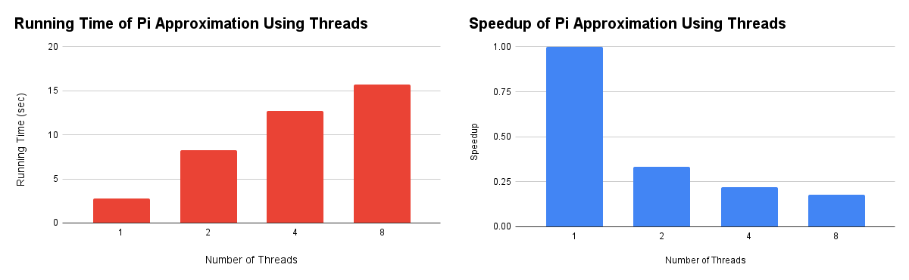
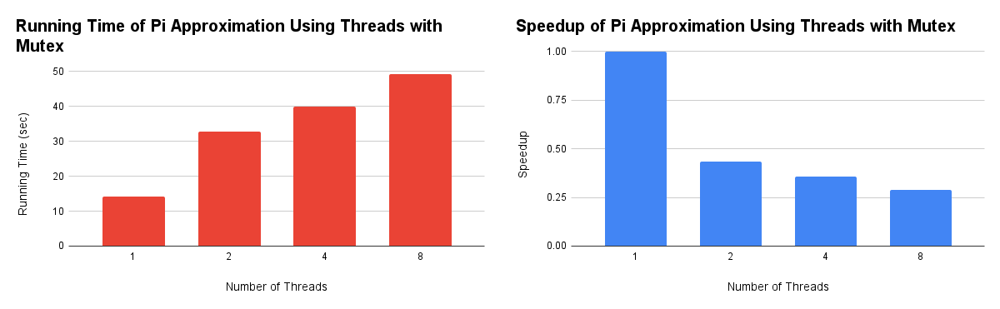
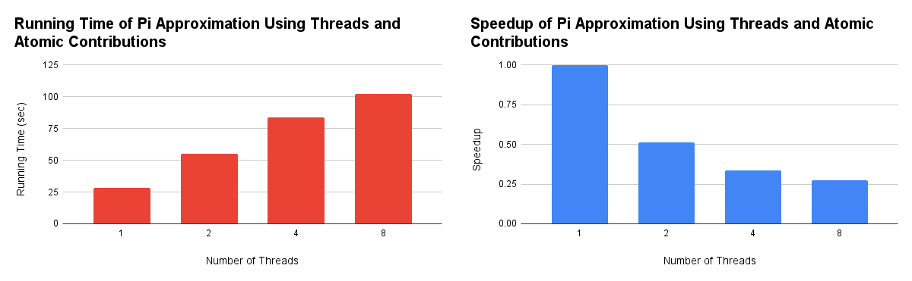
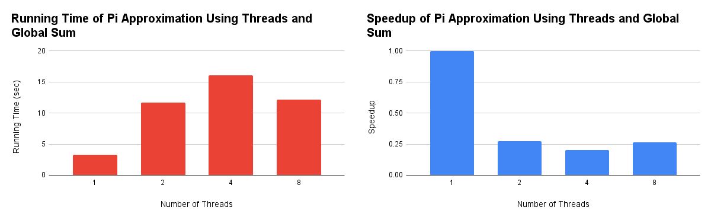
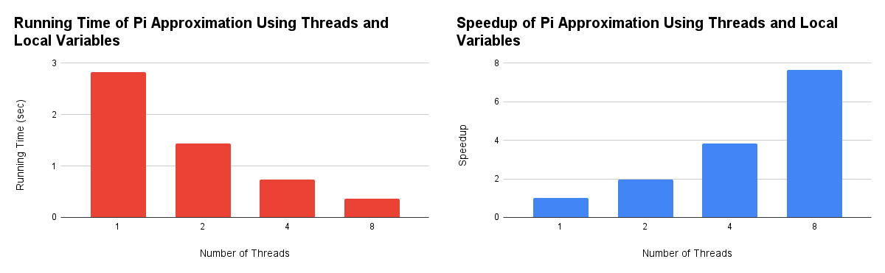
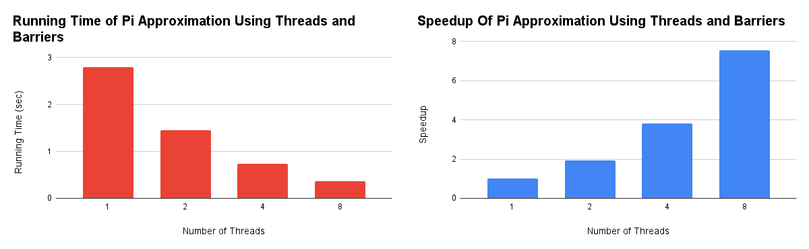

# CS 377P Spring 2026: Assignment 4

### Jenny Nguyen jtn2497

---

#### 1. A sequential program for performing the numerical integration is available here. It is an adaptation of the code I showed you in class. The code includes some header files that you will need in the rest of the assignment. Read this code and run it. It prints the estimate for pi and the running time in nanoseconds. What to turn in:
- Use your knowledge of basic calculus to explain briefly why this code provides an estimate for pi.

The code uses the function $f(x) = 4.0/(1+x*x)$ and computes the areas of rectangles of extremely small widths x and heights of $f(x)$, and sums them up for $[0, 1]$. This is basically just approximating the area under the curve by using rectangles. Using an infinite number of rectangles will be the same as taking the integral of $f(x)$, which is $4arctan(x) + C$, and evaluating that on the interval $[0, 1]$ gives the value of pi.

#### 2. In the rest of this assignment, consider the unit circle centered at the origin. The top half of this circle can be written analytically as $y = sqrt(1-x*x)$ for $x$ between $-1.0$ and $1.0$. What is the area of this semicircle? Write a sequential program to estimate this area by performing numerical integration, using an approach similar to the one in the sequential program given to you. How small does the step size h have to be for your answer to be within 1% of the actual value? You should estimate this using experimentation. What to turn in:
- Your sequential code and the value of h you found experimentally.

```cpp
#include <pthread.h> /*used in other parts of the assignment */
#include <stdlib.h>
#include <math.h>
#include <stdio.h>
#include <stdint.h>  /* for uint64  */
#include <time.h>    /* for clock_gettime */
#include <atomic>    /*used in other parts of the assignment */
#include <cmath>

double f(double x) {
    return sqrt(1-x*x);
}

double pi = 0.0;

int main(int argc, char *argv[]) {
    uint64_t execTime; /*time in nanoseconds */
    struct timespec tick, tock;

    int numPoints = 100000000;
    if (argv[1]) {
        numPoints = atoi(argv[1]);
    }
    double step = 2.0/numPoints;

    clock_gettime(CLOCK_MONOTONIC_RAW, &tick);

    double x = -1.0;
    for (int i = 0; i < numPoints; i++) {
        pi = pi + step*f(x);  // Add to local sum
        x = x + step;  // next x
    }

    clock_gettime(CLOCK_MONOTONIC_RAW, &tock);

    execTime = 1000000000 * (tock.tv_sec - tick.tv_sec) + tock.tv_nsec - tick.tv_nsec;

    printf("elapsed process CPU time = %llu nanoseconds\n", (long long unsigned int) execTime);

    printf("%.20f\n", pi);
    return 0;
}
```

The area of the semicircle is approximately $1.5708$. With numPoints = 23, $h = 2/23 ≈ 0.087$, giving an estimate of $1.5558$, which is within 1% of the actual value.

#### 3. Modify this sequential code as follows to compute the estimate for pi in parallel using pthreads. Your code should create some number of threads and divide the responsibility for performing the numerical integration between these threads. You can use the round-robin assignments of points in the code I showed you in class. Whenever a thread computes a value, it should add it directly to the global variable pi without any synchronization. What to turn in:
- Find the running times (of only computing pi) for one, two, four and eight threads and plot the running times and speedups you observe. What values are computed by your code for different numbers of threads? Why would you expect that these values not to be accurate estimates of pi?

```cpp
#include <pthread.h> /*used in other parts of the assignment */
#include <stdlib.h>
#include <math.h>
#include <stdio.h>
#include <stdint.h>  /* for uint64  */
#include <time.h>    /* for clock_gettime */
#include <atomic>    /*used in other parts of the assignment */

double f(double x) {
    return (4.0/(1+x*x));
}

double pi = 0.0;
int numPoints = 1000000000;
double step;
int num_threads;

void *compute_pi(void* threadIdPtr) {
    int id = *(int*)threadIdPtr;
    
    // Round-robin
    for (int i = id; i < numPoints; i += num_threads) {
        double x = step * ((double) i);
        pi += f(x) * step;
    }

    return NULL;
}

int main(int argc, char *argv[]) {
    num_threads = (argc > 1) ? atoi(argv[1]) : 1;
    pthread_t threads[num_threads];
    int thread_ids[num_threads];
    step = 1.0 / numPoints;

    uint64_t execTime; /*time in nanoseconds */
    struct timespec tick, tock;

    clock_gettime(CLOCK_MONOTONIC_RAW, &tick);

    for (int i = 0; i < num_threads; i++) {
        thread_ids[i] = i;
        pthread_create(&threads[i], NULL, compute_pi, &thread_ids[i]);
    }

    for (int i = 0; i < num_threads; i++) {
        pthread_join(threads[i], NULL);
    }

    clock_gettime(CLOCK_MONOTONIC_RAW, &tock);

    execTime = 1000000000 * (tock.tv_sec - tick.tv_sec) + tock.tv_nsec - tick.tv_nsec;

    printf("elapsed process CPU time = %llu nanoseconds\n", (long long unsigned int) execTime);

    printf("%.20f\n", pi);
    return 0;
}
```



Values of pi computed:
- 1 thread: $3.14159265459007$
- 2 threads: $1.54715503299233$
- 4 threads: $1.08821971602448$
- 8 threads: $0.703195881392417$

The values computed for 2, 4, and 8 threads are much lower than the actual value of pi due to race conditions in the code. All of the threads are accessing and updating the same global value, pi, at the same time without any synchronization. So, the threads are overwriting the other threads' values, which causes the loss of additions to pi that result in lower values as the number of threads increase.

#### 4. In this part of the assignment, you will study the effect of true-sharing on performance. Modify the code in the previous part by using a pthread mutex to ensure that the global variable pi is updated atomically. What to turn in:
- Find the running times (of only computing pi) for one, two, four and eight threads and plot the running times and speedups you observe. What value of pi is computed by your code when it is run on 8 threads?

```cpp
#include <pthread.h> /*used in other parts of the assignment */
#include <stdlib.h>
#include <math.h>
#include <stdio.h>
#include <stdint.h>  /* for uint64  */
#include <time.h>    /* for clock_gettime */
#include <atomic>    /*used in other parts of the assignment */

double f(double x) {
    return (4.0/(1+x*x));
}

double pi = 0.0;
int numPoints = 1000000000;
double step;
int num_threads;
pthread_mutex_t pi_lock;

void *compute_pi(void* threadIdPtr) {
    int id = *(int*)threadIdPtr;
    
    for (int i = id; i < numPoints; i += num_threads) {
        double x = step * ((double) i);
        double local_val = f(x) * step;

        // Lock section
        pthread_mutex_lock(&pi_lock);
        pi += local_val;
        pthread_mutex_unlock(&pi_lock);
    }

    return NULL;
}

int main(int argc, char *argv[]) {
    num_threads = (argc > 1) ? atoi(argv[1]) : 1;
    pthread_t threads[num_threads];
    int thread_ids[num_threads];
    step = 1.0 / numPoints;

    pthread_mutex_init(&pi_lock, NULL);
    uint64_t execTime; /*time in nanoseconds */
    struct timespec tick, tock;

    clock_gettime(CLOCK_MONOTONIC_RAW, &tick);

    for (int i = 0; i < num_threads; i++) {
        thread_ids[i] = i;
        pthread_create(&threads[i], NULL, compute_pi, &thread_ids[i]);
    }

    for (int i = 0; i < num_threads; i++) {
        pthread_join(threads[i], NULL);
    }

    clock_gettime(CLOCK_MONOTONIC_RAW, &tock);

    execTime = 1000000000 * (tock.tv_sec - tick.tv_sec) + tock.tv_nsec - tick.tv_nsec;

    printf("elapsed process CPU time = %llu nanoseconds\n", (long long unsigned int) execTime);

    printf("%.20f\n", pi);
    return 0;
}
```



The value of pi computed by 8 threads is $3.14159265459004$, which is very close to the actual value of pi.

#### 5. You can avoid the mutex in the previous part by using atomic instructions to add contributions from threads to the global variable pi. C++ provides a rich set of atomic instructions for this purpose. Here is one way to use them for your numerical integration program. The code below creates an object pi that contains a field of type double on which atomic operations can be performed. This field is initialized to 0, and its value can be read using method load(). The routine add_to_pi atomically adds the value passed to it to this field. You should read the definition of compare_exchange_weak to make sure you understand how it works. The while loop iterates until this operation succeeds. Use this approach to implement the numerical integration routine in a lock-free manner. What to turn in:
- As before, find the running times (of only computing pi) for one, two, four and eight threads and plot the running times and speedups you observe. Do you see any improvements in running times compared to the previous part in which you used mutexes? How about speedups? Explain your answers briefly. What value of pi is computed by your code when it is run on 8 threads?

```cpp
#include <pthread.h> /*used in other parts of the assignment */
#include <stdlib.h>
#include <math.h>
#include <stdio.h>
#include <stdint.h>  /* for uint64  */
#include <time.h>    /* for clock_gettime */
#include <atomic>    /*used in other parts of the assignment */

double f(double x) {
    return (4.0/(1+x*x));
}

std::atomic<double> pi{0.0};
int numPoints = 1000000000;
double step;
int num_threads;

void add_to_pi(double bar) {
  auto current = pi.load();
  while (!pi.compare_exchange_weak(current, current + bar));
}

void *compute_pi(void* threadIdPtr) {
    int id = *(int*)threadIdPtr;
    
    for (int i = id; i < numPoints; i += num_threads) {
        double x = i * step;
        double contribution = (4.0 / (1.0 + x * x)) * step;
        add_to_pi(contribution);
    }
    return NULL;
}

int main(int argc, char *argv[]) {
    num_threads = (argc > 1) ? atoi(argv[1]) : 1;
    pthread_t threads[num_threads];
    int thread_ids[num_threads];
    step = 1.0 / numPoints;

    uint64_t execTime; /*time in nanoseconds */
    struct timespec tick, tock;

    clock_gettime(CLOCK_MONOTONIC_RAW, &tick);

    for (int i = 0; i < num_threads; i++) {
        thread_ids[i] = i;
        pthread_create(&threads[i], NULL, compute_pi, &thread_ids[i]);
    }

    for (int i = 0; i < num_threads; i++) {
        pthread_join(threads[i], NULL);
    }

    clock_gettime(CLOCK_MONOTONIC_RAW, &tock);

    execTime = 1000000000 * (tock.tv_sec - tick.tv_sec) + tock.tv_nsec - tick.tv_nsec;

    printf("elapsed process CPU time = %llu nanoseconds\n", (long long unsigned int) execTime);

    printf("%.20f\n", pi.load());
    return 0;
}
```



The running time seems to double compared to using mutexes, and the speedup is about the same. This may be because the overhead of the atomic operations is huge due to the presence of true-sharing. If one thread succeeds the `compare_exchange_weak`, then all of the other threads would fail, so they have to loop back and retry. The value of pi computed by the code when run on 8 threads is $3.14159265458983$, which is very close to the actual value of pi.

#### 6. In this part of the assignment, you will study the effect of false-sharing on performance. Create a global array sum and have each thread t add its contribution directly into sum[t]. At the end, thread 0 can add the values in this array to produce the estimate for pi. What to turn in:
- Find the running times (of only computing pi) for one, two, four and eight threads, and plot the running times and speedups you observe. What value of pi computed by your code when it is run on 8 threads?

```cpp
#include <pthread.h> /*used in other parts of the assignment */
#include <stdlib.h>
#include <math.h>
#include <stdio.h>
#include <stdint.h>  /* for uint64  */
#include <time.h>    /* for clock_gettime */
#include <atomic>    /*used in other parts of the assignment */

double f(double x) {
    return (4.0/(1+x*x));
}

double pi = 0.0;
int numPoints = 1000000000;
double step;
int num_threads;
double sum[8];

void *compute_pi(void* threadIdPtr) {
    int id = *(int*)threadIdPtr;
    
    for (int i = id; i < numPoints; i += num_threads) {
        double x = step * ((double) i);

        // Add to global array
        sum[id] = sum[id] + step*f(x);
    }

    return NULL;
}

int main(int argc, char *argv[]) {
    num_threads = (argc > 1) ? atoi(argv[1]) : 1;
    pthread_t threads[num_threads];
    int thread_ids[num_threads];
    step = 1.0 / numPoints;

    uint64_t execTime; /*time in nanoseconds */
    struct timespec tick, tock;

    clock_gettime(CLOCK_MONOTONIC_RAW, &tick);

    for (int i = 0; i < num_threads; i++) {
        thread_ids[i] = i;
        pthread_create(&threads[i], NULL, compute_pi, &thread_ids[i]);
    }

    for (int i = 0; i < num_threads; i++) {
        pthread_join(threads[i], NULL);
        pi += sum[i];
    }

    clock_gettime(CLOCK_MONOTONIC_RAW, &tock);

    execTime = 1000000000 * (tock.tv_sec - tick.tv_sec) + tock.tv_nsec - tick.tv_nsec;

    printf("elapsed process CPU time = %llu nanoseconds\n", (long long unsigned int) execTime);

    printf("%.20f\n", pi);
    return 0;
}
```



Although each thread writes to its own sum index, these elements share cache lines, so each write invalidates the cache line for all other threads, leading to false-sharing. The value of pi computed by the code using 8 threads is $3.14159265458979$.

#### 7. In this part of the assignment, you will study the performance benefit of eliminating both true-sharing and false-sharing. Run the code given in class in which each thread has a local variable in which it keeps its running sum, and then writes its final contribution to the sum array. At the end, thread 0 adds up the values in the array to produce the estimate for pi. What to turn in:
- Find the running times (of only computing pi) for one, two, four and eight threads, and plot the running times and speedups you observe. What value of pi is computed by your code when it is run on 8 threads?

```cpp
#include <pthread.h> /*used in other parts of the assignment */
#include <stdlib.h>
#include <math.h>
#include <stdio.h>
#include <stdint.h>  /* for uint64  */
#include <time.h>    /* for clock_gettime */
#include <atomic>    /*used in other parts of the assignment */

double f(double x) {
    return (4.0/(1+x*x));
}

double pi = 0.0;
int numPoints = 1000000000;
double step;
int num_threads;
double sum[8];

void *compute_pi(void* threadIdPtr) {
    int id = *(int*)threadIdPtr;
    
    double mySum = 0.0;
    for (int i = id; i < numPoints; i += num_threads) {
        double x = step * ((double) i);

        // Add to local sum
        mySum = mySum + step*f(x);
    }

    // Write to global array
    sum[id] = mySum;

    return NULL;
}

int main(int argc, char *argv[]) {
    num_threads = (argc > 1) ? atoi(argv[1]) : 1;
    pthread_t threads[num_threads];
    int thread_ids[num_threads];
    step = 1.0 / numPoints;

    uint64_t execTime; /*time in nanoseconds */
    struct timespec tick, tock;

    clock_gettime(CLOCK_MONOTONIC_RAW, &tick);

    for (int i = 0; i < num_threads; i++) {
        thread_ids[i] = i;
        pthread_create(&threads[i], NULL, compute_pi, &thread_ids[i]);
    }

    for (int i = 0; i < num_threads; i++) {
        pthread_join(threads[i], NULL);
        pi += sum[i];
    }

    clock_gettime(CLOCK_MONOTONIC_RAW, &tock);

    execTime = 1000000000 * (tock.tv_sec - tick.tv_sec) + tock.tv_nsec - tick.tv_nsec;

    printf("elapsed process CPU time = %llu nanoseconds\n", (long long unsigned int) execTime);

    printf("%.20f\n", pi);
    return 0;
}
```



The value of pi computed by the code using 8 threads is $3.14159265458979$.

#### 8. The code used in the previous part used pthread_join. Replace this with a barrier and run your code again. What to turn in:
- Find the running times (of only computing pi) for one, two, four and eight threads, and plot the running times and speedups you observe. What value of pi is computed by your code when it is run on 8 threads?

```cpp
#include <pthread.h> /*used in other parts of the assignment */
#include <stdlib.h>
#include <math.h>
#include <stdio.h>
#include <stdint.h>  /* for uint64  */
#include <time.h>    /* for clock_gettime */
#include <atomic>    /*used in other parts of the assignment */

double f(double x) {
    return (4.0/(1+x*x));
}

double pi = 0.0;
int numPoints = 1000000000;
double step;
int num_threads;
double sum[8];
pthread_barrier_t varBarrier;

void *compute_pi(void* threadIdPtr) {
    int id = *(int*)threadIdPtr;
    
    double mySum = 0.0;
    for (int i = id; i < numPoints; i += num_threads) {
        double x = step * ((double) i);

        // Add to local sum
        mySum = mySum + step*f(x);
    }

    // Write to global array
    sum[id] = mySum;

    // Wait for threads
    pthread_barrier_wait(&varBarrier);

    return NULL;
}

int main(int argc, char *argv[]) {
    num_threads = (argc > 1) ? atoi(argv[1]) : 1;
    pthread_t threads[num_threads];
    int thread_ids[num_threads];
    step = 1.0 / numPoints;

    pthread_barrier_init (&varBarrier,NULL,num_threads + 1);
    uint64_t execTime; /*time in nanoseconds */
    struct timespec tick, tock;

    clock_gettime(CLOCK_MONOTONIC_RAW, &tick);

    for (int i = 0; i < num_threads; i++) {
        thread_ids[i] = i;
        pthread_create(&threads[i], NULL, compute_pi, &thread_ids[i]);
    }

    // Main thread waits
    pthread_barrier_wait(&varBarrier);

    for (int i = 0; i < num_threads; i++) {
        pi += sum[i];
    }

    clock_gettime(CLOCK_MONOTONIC_RAW, &tock);

    execTime = 1000000000 * (tock.tv_sec - tick.tv_sec) + tock.tv_nsec - tick.tv_nsec;

    printf("elapsed process CPU time = %llu nanoseconds\n", (long long unsigned int) execTime);

    printf("%.20f\n", pi);
    return 0;
}
```



The value of pi computed by the code using 8 threads is $3.14159265458979$.

#### 9. Write a short summary of your results in the previous parts, using phrases like “atomic operations,” "true-sharing," and "false-sharing" in your explanation.

Initially, a sequential program computed pi correctly but could not take advantage of multiple cores. Parallelizing without any synchronization improved the speed but produced inaccurate results due to race conditions on the shared variable pi. While initial attempts to ensure accuracy using mutexes and atomic operations succeeded in calculating pi correctly, they suffered from severe performance degradation due to true-sharing, where multiple cores competed for the same memory address and forced constant cache synchronization. Moving to a global array introduced the bottleneck of false-sharing, since the threads were updating independent array indices that resided on the same cache line. Ultimately, the most significant speedup was achieved by using thread-local variables, which eliminated both true-sharing and false-sharing. Replacing pthread_join with a barrier yielded similar performance since the underlying computation was already efficient.